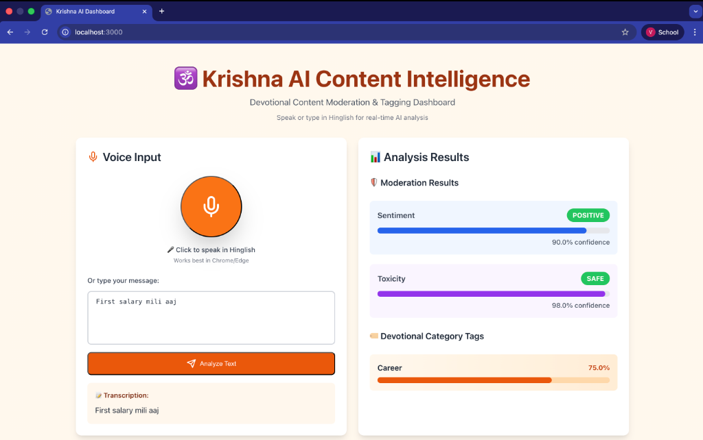

# Krishna AI Content Analyzer

A Hinglish content analysis system for devotional and mental health applications. It combines local ML models with LLM reasoning to analyze sentiment, content safety, and life problem categories in privacy-sensitive environments.



---

## Overview

This system analyzes user messages written in Hinglish (Hindi-English code-mixed language) to understand emotional context, content safety, and problem domains. It is designed for devotional apps, spiritual guidance platforms, and mental health chatbots serving Indian audiences.

**The analyzer supports:**
- Sentiment detection (positive, negative, neutral)
- Toxicity and safety classification
- Life-problem categorization (career, relationships, family, health, mood)

The system is optimized for local deployment where privacy, cost control, and low dependency on external APIs are important.

---

## Problem Context & Approach

Indian users naturally mix Hindi and English while expressing emotions and problems. Most standard NLP systems struggle with this pattern because they are trained on monolingual data or rely on translation pipelines that lose nuance.

This project addresses the problem using a **hybrid, tiered classification approach**. Common linguistic patterns are handled using fast, deterministic rules, while complex or ambiguous inputs are resolved using LLM-based reasoning.

**The guiding principles are:**
- Local-first processing
- Tiered execution for performance and cost efficiency
- Explicit fallbacks to ensure stable behavior

---

## Architecture Overview

```
┌─────────────────────────────────────────────────────────────┐
│                     Flask API Server                         │
│  HTTP transport and request validation                       │
└──────────────────────┬──────────────────────────────────────┘
                       │
                       ▼
┌─────────────────────────────────────────────────────────────┐
│                  DevotionalAnalyzer                          │
│  Orchestrates classification tasks                           │
└──────────────────────┬──────────────────────────────────────┘
                       │
        ┌──────────────┼──────────────┬──────────────┐
        ▼              ▼              ▼              ▼
   ┌────────┐   ┌─────────────┐  ┌────────┐   ┌─────────┐
   │Toxicity│   │LlamaClassifier│ │Sentiment│  │Category │
   │ BERT   │   │  (5 Tiers)   │  │  BERT  │   │Embedding│
   └────────┘   └─────────────┘  └────────┘   └─────────┘
```

The API layer is intentionally thin and contains no business logic. Classification logic is isolated so that transport layers or models can be replaced without cascading changes.

### Component Responsibilities

**`app.py`**  
Handles HTTP requests and validation. This layer is intentionally minimal.

**`models.py`**  
Acts as the central orchestrator. Loads models at startup and delegates requests to the appropriate classifiers.

**`llama_classifier.py`**  
Implements the 5-tier classification pipeline, combining deterministic rules with LLM reasoning for complex cases.

This separation keeps concerns isolated and makes the system easier to test, extend, and maintain.

---

## Project Structure

```
krishna-ai-dashboard/
├── backend/
│   ├── app.py                    # Flask API server
│   ├── models.py                 # Core orchestrator
│   ├── llama_classifier.py       # 5-tier classification engine
│   ├── requirements.txt          # Python dependencies
│   ├── .env.example              # Configuration template
│   └── SETUP_OLLAMA.md          # Ollama installation guide
├── frontend/
│   ├── src/App.jsx              # React UI
│   ├── package.json
│   └── .env
├── docs/
│   └── dashboard-screenshot.png
├── .gitignore
└── README.md
```

The structure reflects separation by responsibility rather than file type.

---

## Key Technical Decisions

**Llama 3.2** was chosen over hosted APIs to allow local inference, protect user privacy, and avoid recurring costs.

**A tiered classification pipeline** ensures that simple cases are resolved quickly, while complex inputs still receive deeper semantic analysis.

**Flask** was selected for simplicity and ecosystem maturity. Async frameworks were not required because the primary latency comes from model inference rather than I/O.

**Local models** are preferred to keep sensitive devotional and mental health content on-server and avoid external dependencies.

---

## Execution Flow

At startup, the application loads all models once and keeps them resident in memory. For each request, the analyzer evaluates rule-based tiers first and only invokes the LLM when needed.

**Request Processing:**
```
POST /analyze {"text": "Job achhi hai par ghar se door"}
    ↓
Request validation
    ↓
Tier 1-3: Rule-based handlers (compound statements, achievements, family context)
    ↓
Tier 4: Keyword matching (fast, high-confidence)
    ↓
Tier 5: Llama 3.2 LLM (complex cases)
    ↓
Response formatting
```

This design keeps most requests fast while preserving coverage for edge cases.

---

## Running the Project

### Prerequisites
- Python 3.9+
- Node.js 14+
- Ollama (for Llama 3.2)

### Backend

```bash
cd backend
python3 -m venv venv
source venv/bin/activate  # Windows: venv\Scripts\activate
pip install -r requirements.txt

# Configure environment
cp .env.example .env
# Edit .env and add GOOGLE_API_KEY (optional, for fallback)

# Install Ollama and Llama 3.2
curl -fsSL https://ollama.com/install.sh | sh
ollama pull llama3.2:3b
ollama serve  # Keep this running

# Start backend (new terminal)
cd backend
source venv/bin/activate
python app.py
```

Backend runs on: `http://localhost:50010`

### Frontend

```bash
cd frontend
npm install

# Create frontend/.env with:
# REACT_APP_API_URL=http://localhost:50010

npm start
```

Frontend opens at: `http://localhost:3000`

### Verify Installation

```bash
curl -X POST http://localhost:50010/analyze \
  -H "Content-Type: application/json" \
  -d '{"text": "Kal interview hai, tension ho raha hai"}'
```

---

## Design Considerations

The system is optimized for Hinglish code-mixed inputs and prioritizes deterministic behavior where possible. It uses a stateless design to avoid retaining user data and to simplify deployment in privacy-sensitive environments.

**Scope boundaries:**
- Language support is optimized for Hinglish patterns
- Designed for single-instance deployment
- Stateless architecture prioritizes privacy over analytics

The architecture supports future extensions such as caching, monitoring, and asynchronous processing without requiring a rewrite.

---

## Extensibility

The current design allows:
- Swapping or fine-tuning models without API changes
- Adding observability and metrics for production deployments
- Introducing batching or async execution for higher throughput

These enhancements can be layered on top of the existing architecture.

---

## Technical Stack

**Backend:**
- Flask (API server)
- Transformers (BERT models)
- Sentence-Transformers (embeddings)
- Ollama (Llama 3.2 inference)

**Frontend:**
- React
- Web Speech API (voice input)

**Models:**
- Llama 3.2 3B (via Ollama)
- unitary/toxic-bert (toxicity)
- cardiffnlp/twitter-xlm-roberta-base-sentiment
- all-MiniLM-L6-v2 (embeddings)

---

## License

MIT License

---

**Designed for real-world Hinglish understanding in privacy-sensitive applications.**
